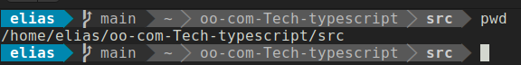
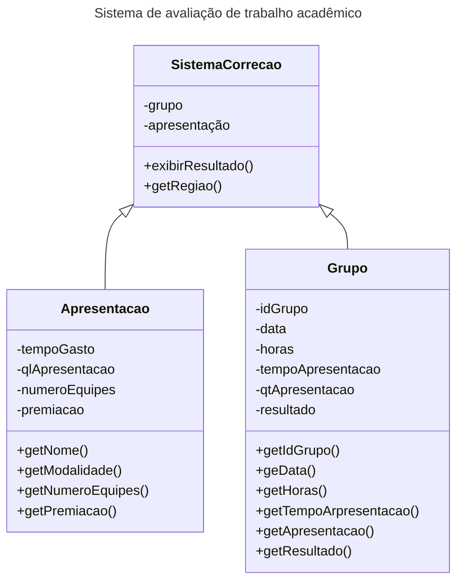

`## OO-Com-TypeScript

#### Participantes: 
```typescript
- Elias
- Rafael
- Vidaflor
- Pedro Henrique Marques Siqueira
- Antônio
```
# Introdução:
> Olá a todos! Hoje estaremos explorando o TypeScript, uma linguagem de programação que traz recursos adicionais para o JavaScript, incluindo suporte a tipos estáticos e paradigma orientado a objetos.
> O TypeScript é compilado para JavaScript, tornando-o compatível com qualquer navegador moderno. Durante esta apresentação, vamos interagir e escrever código em **TypeScript** e navegador na aplicação ou no servidor.

# I. O que é o TypeScript?
O TypeScript é uma linguagem de programação desenvolvida pela Microsoft que estende o JavaScript, adicionando recursos de tipagem estática e suporte a classes, interfaces, herança e outros conceitos da orientação a objetos.

## II. Vamos configurar o ambiente para o desenvolvimento uma aplicação em TypeScript:
1. Inicialmente, vamos verificar se o Node.js está instalado na máquina. Para isso, abra o terminal e digite o seguinte comando. Este comando retornará a versão do **node** :
   ```
   node -v
   ```

2. Caso o Node.js não esteja instalado, acesse o site oficial (https://nodejs.org) e faça o download da versão adequada ao seu sistema operacional.

3. Com o Node.js já instalado, o próximo passo é instalar o TypeScript globalmente. No terminal, execute o seguinte comando:

   via **npm**
   ```
   sudo apt npm install -g typescript
   
   ```
   ou via **apt**
   
   ```typescript
   sudo apt install node-typescript

   ```
   
## III. Exemplo de código:
Agora que o ambiente de desenvolvimento foi devidamente configurado, o próximo passo será criar uma classe simples em TypeScript e compilar para JavaScript.
1. Crie um novo arquivo chamado "exemplo.ts" em seu editor de texto favorito. No nosso caso, vamos utilizar o vim. Adicione o seguinte código:
   
   ```typescript
   class Pessoa {
      nome: string;
      idade: number;
    
      constructor(nome: string, idade: number) {
        this.nome = nome;
        this.idade = idade;
      }
      saudacao() {
        console.log(`Olá, meu nome é ${this.nome} e tenho ${this.idade} anos.`);
     }
   }
     
   ```
   Instanciando a classe pessoa com a diretiva **const**
   
   ```typescript
   const pessoa1 = new Pessoa("Elias", 25);
   pessoa1.saudacao();
   ```

3. Agora, no terminal, navegue até o diretório onde você salvou o arquivo "exemplo.ts" e compile-o usando o TypeScript:
   ```
   tsc exemplo.ts
   ```

4. Isso irá gerar um novo arquivo chamado "exemplo.js". Abra-o para ver o código JavaScript equivalente ao código TypeScript que foi escrito.


## IV. Executando o exemplo no navegador:

1. Crie um novo arquivo HTML chamado "index.html" em seu editor de texto e adicione o seguinte código. Note que este arquivo é o responsável para chamar outras páginas no servidor web:
   
   ```html
   <!DOCTYPE html>
   <html>
   <head>
     <title>Exemplo TypeScript</title>
     <script src="exemplo.js"></script>
   </head>
   <body>
     <script>
       pessoa1.saudacao();
     </script>
   </body>
   </html>
   
   ```

3. Salve o arquivo e abra-o em seu navegador. Abra o console do navegador para ver a saudação sendo exibida.

   Digite o comando abaixo no terminal do repositório e copia o retor do comanda para o navegador para testar a aplicação **index.html**
 
   ```
   pwd
   ```
   

## V. Executando o exemplo no **web local**:
Se você deseja executar um arquivo HTML sem usar um navegador, pode fazê-lo utilizando um servidor web local. Um servidor web local permite que você hospede e execute o arquivo HTML em um ambiente semelhante ao de um servidor real, mas apenas no seu computador.

Aqui estão os passos para executar um arquivo HTML usando um servidor web local:

1. Escolha um servidor web local: Existem várias opções disponíveis para criar um servidor web local, sendo algumas das mais populares:

   - Node.js com o pacote http-server: Se você já tem o Node.js instalado no seu computador, pode usar o pacote http-server para criar um servidor web local rapidamente. Basta instalar o pacote globalmente usando o npm (gerenciador de pacotes do Node.js) e executá-lo a partir do diretório onde o seu arquivo HTML está localizado.

   Para instalar o http-server globalmente, abra o terminal e digite:
   ```
   npm install -g http-server
   ```

   Em seguida, navegue para o diretório onde o seu arquivo HTML está localizado e execute o servidor com o seguinte comando:
   ```
   http-server
   ```

   - Python: Se você tem o Python instalado no seu computador, pode usar o módulo http.server para criar um servidor web local. Basta abrir o terminal ou prompt de comando, navegar até o diretório onde o arquivo HTML está localizado e executar o seguinte comando:

   ```
   python -m http.server
   ```

   Isso criará um servidor web local na porta 8000 (outra opção é usar a porta 8080 executando `python -m http.server 8080`).

2. Acesse o arquivo HTML: Após iniciar o servidor web local, abra o seu navegador e digite o seguinte endereço na barra de endereços:

   ```
   http://localhost:8080
   ```

   (Ou qualquer outra porta que você escolheu, se for diferente da padrão)

   Isso abrirá o arquivo HTML no servidor web local, permitindo que você veja e interaja com a página sem a necessidade de usar um servidor real.

Lembre-se de que, para executar um servidor web local, você precisa ter o arquivo HTML presente no diretório onde está executando o servidor. Se você quiser executar scripts ou interagir com o HTML, certifique-se de que quaisquer recursos (por exemplo, scripts JavaScript) estejam corretamente referenciados e disponíveis no mesmo diretório.

## VI. Outras vantagems quando se trata de métodos Paradigma Orientado a Objetos

1. Tipos de dados estáticos:

Uma das principais vantagens do TypeScript é a capacidade de adicionar tipos estáticos às variáveis, funções e objetos. Isso ajuda a evitar erros de digitação, melhora a legibilidade do código e oferece suporte ao desenvolvimento de software mais seguro. Veja um exemplo:

```typescript
let nome: string = "Elias Miranda";
let idade: number = 25;
let ativo: boolean = true;

function saudacao(nome: string): void {
 console.log("Olá, " + nome + "!");
}
```

```typescript
saudacao(nome);
```

2. Classes e Objetos:
Em TypeScript, podemos usar o conceito de classes para criar objetos. As classes nos permitem definir propriedades e métodos que descrevem o comportamento dos objetos. Vamos ver um exemplo:

```typescript
class Pessoa {
  nome: string;
  idade: number;

  constructor(nome: string, idade: number) {
    this.nome = nome;
    this.idade = idade;
  }

  apresentar(): void {
    console.log("Olá, meu nome é " + this.nome + " e eu tenho " + this.idade + " anos.");
  }
}
```

```typescript
let pessoa1 = new Pessoa("Maria", 30);
pessoa1.apresentar();
```

3. Herança e Polimorfismo:
Outro conceito importante da programação orientada a objetos é a herança, que permite que uma classe herde propriedades e métodos de outra classe. O TypeScript suporta herança de classes usando a palavra-chave `extends`. Vamos ver um exemplo:

```typescript
class Estudante extends Pessoa {
  matricula: string;

  constructor(nome: string, idade: number, matricula: string) {
    super(nome, idade);
    this.matricula = matricula;
  }

  apresentar(): void {
    console.log("Oi, meu nome é " + this.nome + " e eu sou um estudante.");
  }
}
```

```typescript
let estudante1 = new Estudante("Carlos", 20, "12345");
estudante1.apresentar();
```

4. Interfaces:
As interfaces são usadas para definir contratos para classes e objetos. Elas especificam quais propriedades e métodos devem ser implementados. As interfaces são úteis para alcançar o polimorfismo e garantir que as classes cumpram determinados requisitos. Vejamos um exemplo:

```typescript
interface Animal {
  nome: string;
  fazerBarulho(): void;
}

class Cachorro implements Animal {
  nome: string;

  constructor(nome: string) {
    this.nome = nome;
  }

  fazerBarulho(): void {
    console.log(this.nome + " está latindo!");
  }
}
```

```typescript
let cachorro1 = new Cachorro("Bobby");
cachorro1.fazerBarulho();
```


# Problemas com Paradigmas Anteriores ao TypeScript

Antes do TypeScript, os desenvolvedores utilizavam principalmente o JavaScript puro, que é uma linguagem de programação de tipagem dinâmica. Essa abordagem apresentava alguns problemas significativos:

1. **Falta de Verificação de Tipos em Tempo de Compilação:** No JavaScript, a verificação de tipos ocorre apenas em tempo de execução. Isso significa que erros de tipo só são descobertos quando o código é executado, resultando em comportamentos inesperados e bugs que podem ser difíceis de rastrear.

2. **Código Propenso a Erros:** Devido à tipagem dinâmica, é fácil cometer erros de tipo, como atribuir valores incompatíveis a variáveis ou chamar funções com argumentos incorretos. Isso pode levar a resultados inesperados e difíceis de depurar.

3. **Manutenção Difícil em Projetos Grandes:** À medida que as aplicações crescem em escala e complexidade, o código JavaScript pode se tornar difícil de manter. A falta de informações claras sobre tipos e interfaces pode tornar a compreensão do código mais desafiadora, especialmente em projetos com várias equipes trabalhando em paralelo.

4. **Ausência de Ferramentas de Suporte Adequadas:** O ecossistema JavaScript evoluiu rapidamente, mas durante algum tempo, as ferramentas de desenvolvimento, como editores de código e IDEs, não ofereciam um suporte robusto para a verificação de tipos e refatoração de código.

5. **Integração com Bibliotecas e Frameworks:** Algumas bibliotecas e frameworks populares não possuíam suporte nativo para tipagem estática. Isso significava que os desenvolvedores podiam perder os benefícios da verificação de tipos ao utilizar essas ferramentas.

## A Solução do TypeScript

O TypeScript foi criado para abordar esses problemas, proporcionando uma abordagem mais segura e estruturada ao desenvolvimento de aplicativos JavaScript. As principais características e vantagens do TypeScript são:

- **Tipagem Estática Opcional:** O TypeScript permite a adição de tipos estáticos aos elementos do código, fornecendo assim uma verificação de tipos em tempo de compilação. Isso ajuda a evitar erros de tipo e torna o código mais confiável.

- **Facilidade de Refatoração:** Com informações de tipos mais ricas, o TypeScript permite a realização de refatorações com mais confiança, pois a IDE pode identificar e atualizar automaticamente todas as ocorrências do código afetado.

- **Maior Legibilidade e Documentação:** A tipagem explícita torna o código mais legível e autodocumentado, facilitando a compreensão para outros desenvolvedores, incluindo os membros da equipe que não escreveram o código originalmente.

- **Suporte a Ferramentas e Bibliotecas:** O TypeScript tem uma ampla adoção na comunidade de desenvolvimento, e muitas bibliotecas e frameworks populares oferecem suporte nativo ao TypeScript, o que facilita a integração e proporciona uma experiência mais consistente.

- **Ecossistema em Expansão:** O TypeScript continua a evoluir, com melhorias regulares e atualizações da linguagem. Além disso, a comunidade em torno do TypeScript é ativa, o que leva ao desenvolvimento de ferramentas e plugins que aprimoram ainda mais a experiência de desenvolvimento.


[Arquivo em Markdown](sandbox:/mnt/files/problems-with-previous-paradigms.md)
## VII. Conclusão:

Esses são apenas alguns exemplos de como o TypeScript suporta o paradigma orientado a objetos. Com o TypeScript, podemos aproveitar a **tipagem estática, classes, herança, interfaces**
e muito mais para escrever código mais seguro e reutilizável. Vimos como criar uma classe simples, compilar o código para JavaScript e executá-lo em um navegador out servidlor logal.
O TypeScript oferece uma maneira poderosa de escrever código JavaScript mais seguro e escalável. Em resumo, o TypeScript soluciona problemas comuns encontrados em paradigmas anteriores
ao oferecer uma tipagem estática opcional, melhorando a qualidade do código, facilitando a manutenção e proporcionando uma experiência de desenvolvimento mais segura e produtiva.
Agora que você tem uma noção básica do TypeScript, sinta-se à vontade para explorar mais recursos, como **herança, interfaces e tipos estáticos**. Divirta-se programando!
`


## Referências

- <span style="color: #008080">[w3schools](https://www.w3schools.com/typescript/): TypeScript Tutorial.</span>
- <span style="color: #008080">[typescriptlang.org](https://www.typescriptlang.org/pt/docs/handbook/typescript-in-5-minutes.html): TypeScript para programadores JavaScript.</span>
- <span style="color: #008080">[chat](https://chat.openai.com): IA.</span>

*Diagrama de classe UML*


